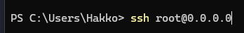

## Connecting to your Linux dedicated server

1. Check your email for the information used to connect to your server.
2. Depending on your OS, you might have to install an SSH Client such as [PuTTY](https://www.putty.org/) or [MobaXTerm](https://mobaxterm.mobatek.net/). I'll be using Windows Terminal for this example.
3. Type `ssh <servers_username>@<servers_ip_address>` and hit enter.
Example: 

4. Press enter and then enter the passsword in the email you recieved.
5. Congrats! You've successfully connected to your server!

## Connecting to your Windows dedicated server

1. Check your email for the information used to connect to your server.
2. Depending on your OS, you might have to install an RDP or Remote Desktop Connection client. Windows 10/11 comes with it by default, and that's what I'll be using in this example.
3. Open your RDP software of choice, and enter the servers IP Address.
4. You will then be prompted to enter the username & password of the machine you're attempting to connect to. Enter the respective information from the email.
5. Congrats! You've successfully connected to your server!