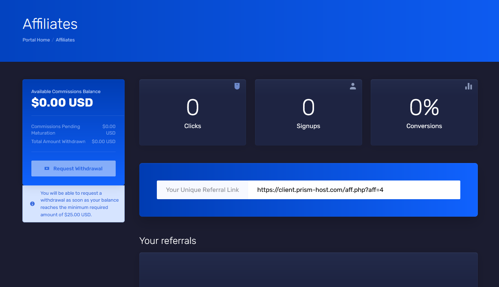

## How to Activate

1. Login to the [Client Portal](https://client.prism-host.com)
2. Navigate to the [Affiliates](https://client.prism-host.com/affiliates.php) page
3. Click "Activate Affiliate Account", once activated, you'll see this page:

4. Once activated, you'll see a unique referral link. You can use this to refer your friends to us for a commission. As long as they use your link when they purchase a service, you'll receive a commission from it every month. The commission percentage depends on the service ordered. It ranges from 5% to 10%.
5. Once you've reached $25 or more in commissions, you can click the "Request Withdrawal" button. This will open a ticket and our customer success team will reach out and deliver the funds.

