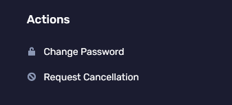
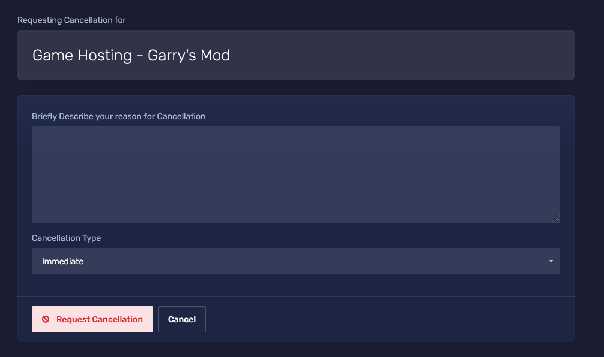

import { Aside } from '@astrojs/starlight/components';

## Cancelling a service

1. Login to the [Client Portal](https://client.prism-host.com)

2. Click on services to view all your services

3. Click on the service you want to cancel

4. Click "Request Cancellation" under "Actions" on the left-hand side

5. Fill out the form that appears when you click "Request Cancellation". You can select if you wish to cancel it immediately or at the end of the billing period
<Aside type="caution" title="Note">
  Please provide useful feedback to your cancellation reason. This helps us improve our services and quality for the next customer.
</Aside>

6. Upon requesting cancellation, you will receive an email confirming such.

<Aside type="caution" title="Note">
 Immediate cancellation does not constitute a refund for the remaining period of time left on your service.
</Aside>