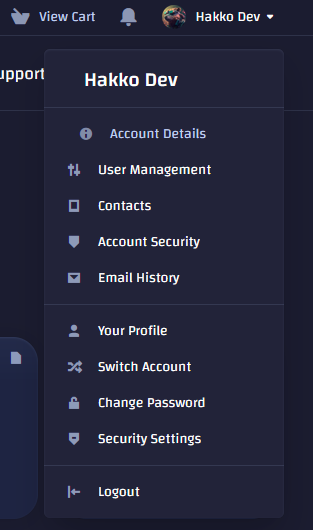
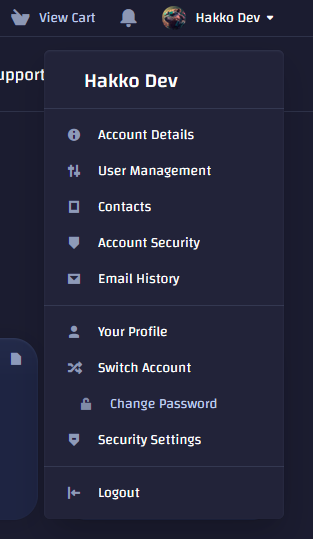
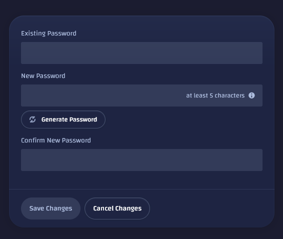
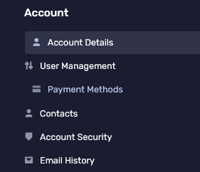
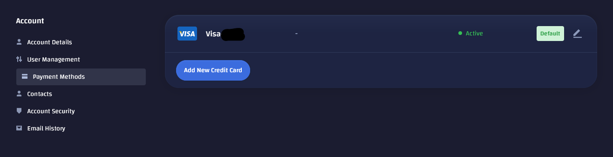

import { Aside } from '@astrojs/starlight/components';

## How to change basic account info

1. Login to the [client portal](https://client.prism-host.com/)
2. Click on your name in the top right and choose "Account Details"

3. Then you can edit all of the information on this page such as your Name, Phone Number, billing address and email prefrences.

## How to change account password

1. Login to the [client portal](https://client.prism-host.com/)
2. Click on your name in the top right and choose "Change Password"

3. Enter your existing password then enter the new password you want to change it to.

<Aside type="caution" title="Info">
  If you have forgotten your password, please click the "Forgot?" text above the password text box on the login screen.
</Aside>

## How to change or edit payment methods
1. Login to the [client portal](https://client.prism-host.com/)
2. Click on your name in the top right and choose "Account Details"

3. On the right side, choose "Payment Methods"

3. Then you can edit or add a new payment method.
