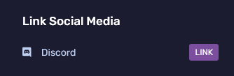
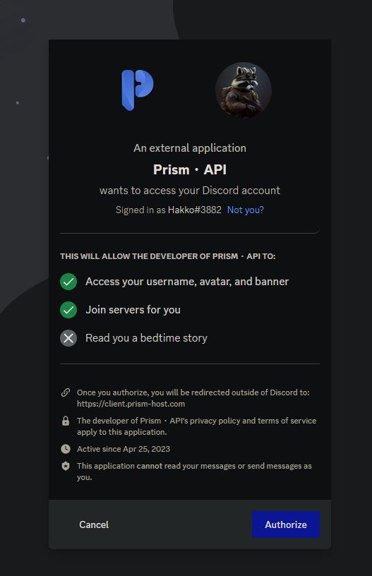
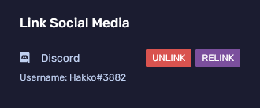

## Adding a sub-user

1. Login to the [Client Portal](https://client.prism-host.com)

2. Find the "Link Social Media" on the left sidebar and click "Link" next to Discord

3. When prompted, click Authorize. This does not grant us access to use your account, this will only Join our Discord for you & access your username, avatar, and banner.

4. Once completed, you should see this on the left-hand side under "Link Social Media":

