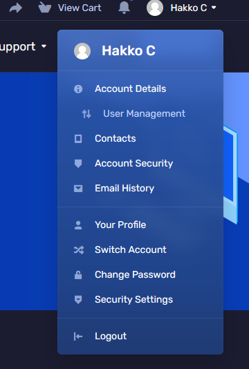
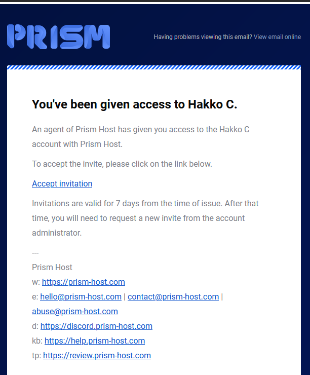
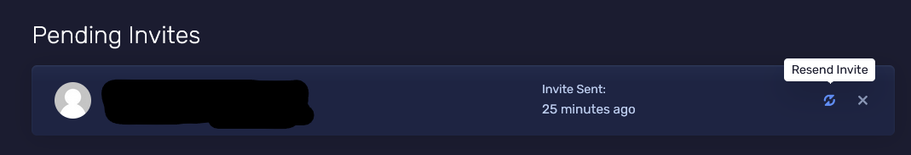
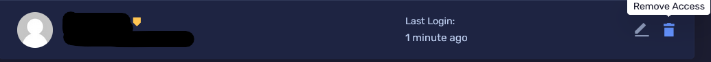
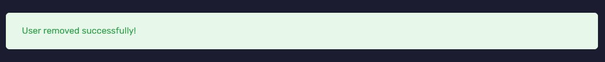

import { Aside } from '@astrojs/starlight/components';

## Adding a sub-user

1. Login to the [Client Portal](https://client.prism-host.com)

2. Click on your name on the top right and choose "User Management"

3. Choose "Invite New User" and then fill out the corresponding email address & assign the permissions.

4. Once sent, the user will receive an email inviting them to your account. They need to click "Accept Invitation" in order to accept the invitation.

<Aside title="If the user never received the email, you may resend it by clicking 'Resend Invite'. ">
    
</Aside>

## Removing a sub-user

1. Login to the [Client Portal](https://client.prism-host.com)

2. Click on your name on the top right and choose "User Management"

3. Click the remove access button on the user you want to remove.

4. Click "Confirm" to confirm the removal.

5. If the account was removed successfully, you'll receive a confirmation message stating "User Removed Successfully!"

