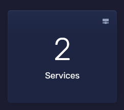
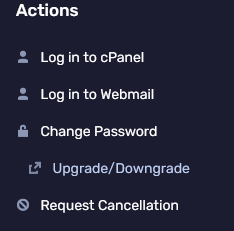
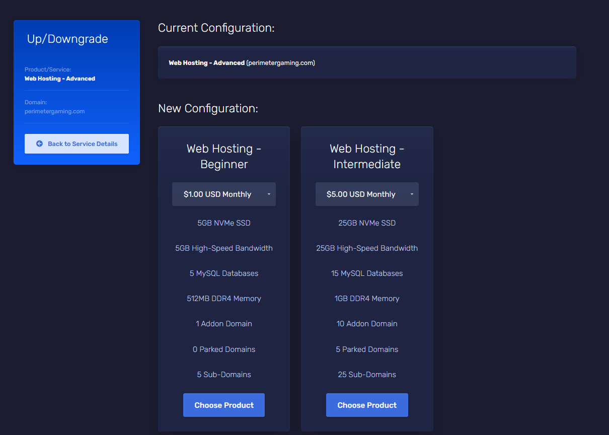

import { Aside } from '@astrojs/starlight/components';

## Upgrading & Downgrading

<Aside type="caution" title="Note">
  VPS can only be upgraded through a ticket, and may not be downgraded after the fact. Reach out to support to perform the upgrade for you.
</Aside>

1. Login to the [Client Portal](https://client.prism-host.com)

2. Click "Services" to view all of your services.

3. Select the service you wish to upgrade or downgrade.

4. Choose "Upgrade/Downgrade" from the left sidebar.

5. Select the plan you wish to upgrade/downgrade to.
<Aside type="caution" title="Note">
  Make sure you select a plan that can accommadate your current resource usage.
</Aside>

6. Once you've chosen the plan you want to upgrade/downgrade to, you'll be taken to the checkout page. Please note, refunds will not occur for downgrades. Upgrade price is calculated from a credit of the unused portion of the current plan and billing of the new plan for the same period.
7. Once you've placed the order, your service will be upgraded/downgraded as soon as the payment is verified. If you are currently using more resources then what your plan allows, you will be required to upgrade before your service will become available.