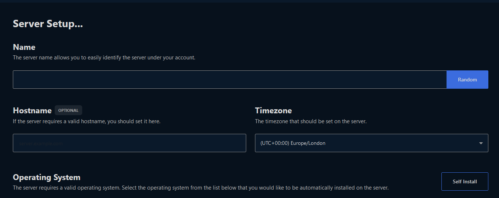
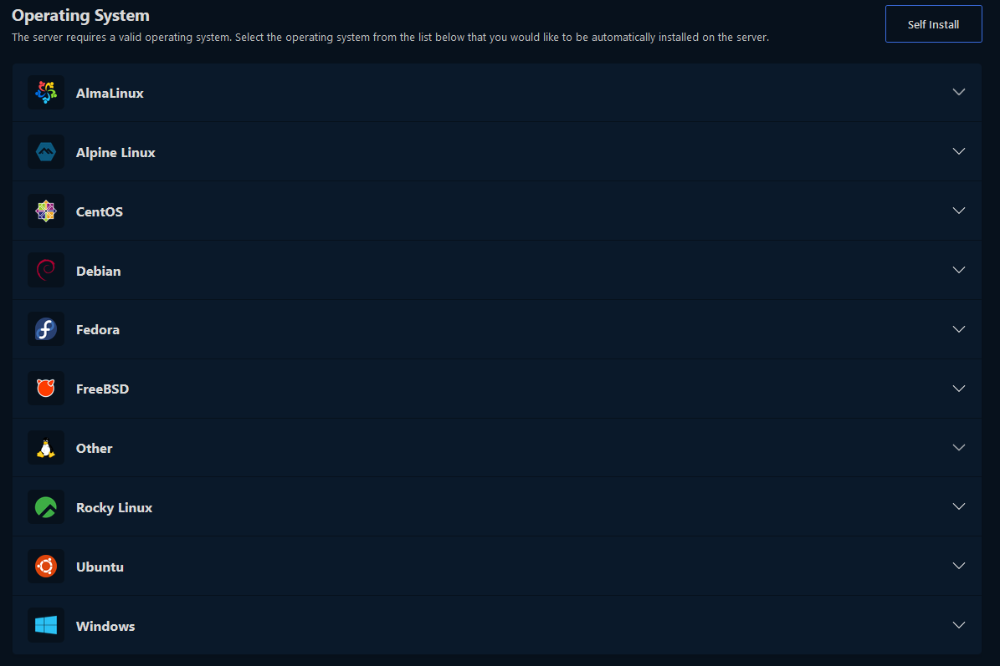
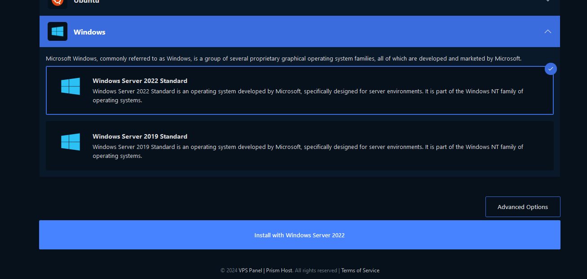
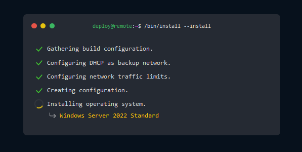

import { Aside } from '@astrojs/starlight/components';

## Installing the OS

1. Check your email for a link to login to our [VPS Panel](https://panel.vpsnode.me).
2. Upon logging in, click on the server that says "Awaiting Setup".
3. Here you may fill in a server name, or generate a random one and set the timezone. You can safely ignore the "Hostname" field if you don't know what it means.

4. Scroll down on that page, choose the OS you want. Each one will have a dropdown of versions available to it.

<Aside type="caution" title="Warning!">
  Windows requires a VPS with 4GB of RAM or more!
</Aside>

5. Choose the OS and version you want, then click "Install with ..." at the bottom. If you get a prompt, you can safely click "Install Now"

<Aside type="caution" title="Warning!">
  If you want to setup SSH Keys, you can do so now, or you can do it at a later date.
</Aside>

6. Your OS will now be installed. Please note, this may take up to 30 minutes. From here, all of the information you need to connect will be emailed to you upon install finish.

